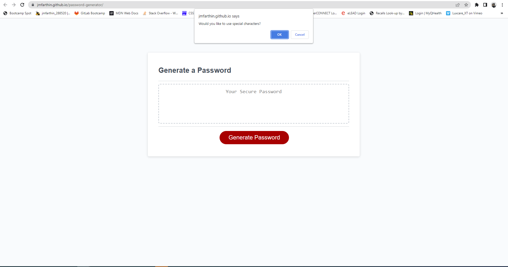

# Password Generator

## Description

This project adds functionality to a random password generator which the site previously did not have using javascript. This functionality was achieved using the following: 

- logical comparisons
- built-in Math functions
- iteration
- functions
- methods
- objects

## Usage

To view password generator website, visit: https://jmfarthin.github.io/password-generator/

Repository: https://github.com/jmfarthin/password-generator.git

To generate a new password, click on the 'generate password' button and follow the prompts.

### Screenshots of deployed website:

## Credits

Xander Rapstine: for starter code

## License

Licensed under the general usage MIT license.
Copyright (c) 2023 Justin Farthing